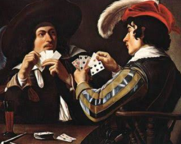
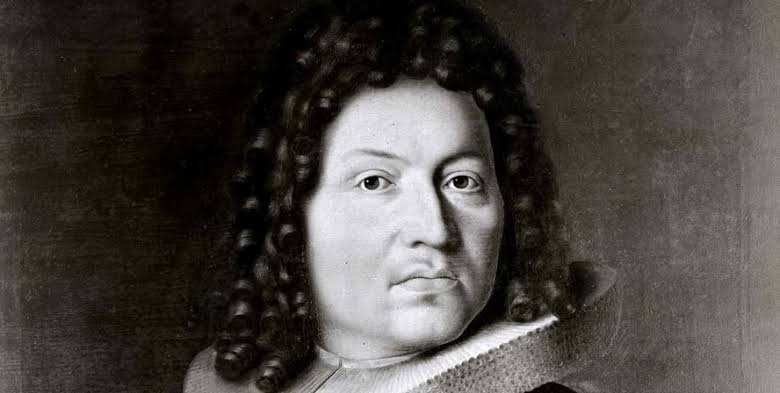
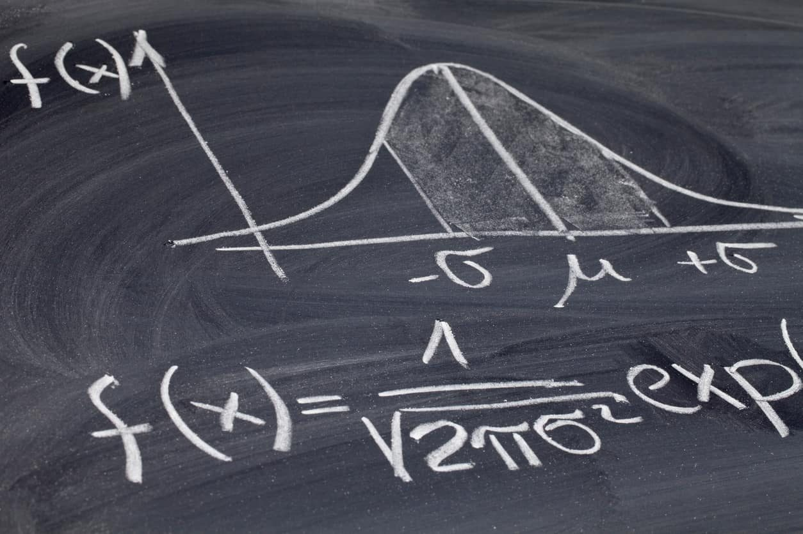
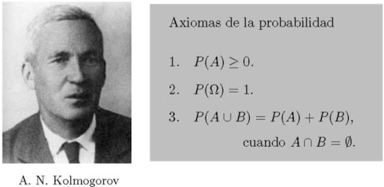

<h1 align="center">  Modelos Estadísticos </h1> 

  
 

Los modelos estadísticos, también conocidos como modelos probabilísticos, son representaciones matemáticas que nos ayudan a entender, describir y hacer inferencias sobre fenómenos en los que interviene el azar. A diferencia de los modelos matemáticos determinísticos (como la ley de Newton F=ma), que asumen que un resultado se puede predecir con total exactitud, un modelo estadístico incorpora un componente de error aleatorio (denotado usualmente como ϵ). 

  
 

Este término de error reconoce nuestra incapacidad para modelar la naturaleza de forma exacta y captura la variación aleatoria producida por numerosas variables no medidas o incontrolables que afectan el resultado. El objetivo central de construir un modelo estadístico es realizar inferencias estadísticas. Es decir, se utiliza la información extraída de una muestra de datos limitados para poder generalizar conclusiones hacia la población completa, estimar parámetros poblacionales y predecir resultados futuros, permitiendo además calcular la probabilidad de cometer errores en dichas predicciones. 

<h2 align="center"> Desarrollo Histórico </h2> 

La formalización de la probabilidad y la estadística para modelar la realidad se ha construido a lo largo de varios siglos, impulsada por distintas disciplinas: Los juegos de azar (Siglo XVII): Los esfuerzos por encontrar métodos matemáticos para la incertidumbre iniciaron de manera formal en el año 1654. El caballero De Méré (Antoine de Gombaud), un apostador, le planteó un problema sobre juegos de azar a Blaise Pascal, quien a su vez inició un intercambio epistolar con Pierre de Fermat para darle solución. 

  
 

La Ley de los Grandes Números (Siglos XVI y XVIII): El matemático Gerolano Cardano (1501-1576) ya había observado que las estadísticas empíricas mejoraban su precisión al incrementar el número de observaciones. Fue en 1713 cuando Jacobo Bernoulli logró formalizar rigurosamente este comportamiento, dando origen al teorema que hoy conocemos como la Ley de los Grandes Números. 

  
 

La Distribución Normal (Siglos XVIII y XIX): Uno de los modelos estadísticos continuos más importantes, la curva normal, fue introducida en 1733 por el francés Abraham DeMoivre, inicialmente para aproximar probabilidades en el lanzamiento de monedas (variables binomiales). Su verdadera utilidad y alcance se hizo patente en 1809 cuando el famoso matemático alemán Karl Friedrich Gauss la utilizó para predecir trayectorias astronómicas, por lo que frecuentemente se le llama distribución gaussiana. Más tarde, en 1812, Pierre-Simon Laplace la extendió al observar que los errores de medición en experimentos tendían a distribuirse de esta forma, enunciando el Teorema Central del Límite.

  
 

Axiomatización (Siglo XX): Pese al desarrollo empírico y analítico, la teoría carecía de fundamentos matemáticos estrictos. En el año 1900, David Hilbert planteó como un problema matemático importante la necesidad de encontrar axiomas para la probabilidad. 

  
 Esto fue resuelto en 1933 por el matemático ruso A. N. Kolmogorov, quien relacionó la probabilidad con la teoría de la medida de Borel y Lebesgue, construyendo la fundamentación axiomática (teoría clásica) que se sigue utilizando hoy en día. 

Los modelos estadísticos nacieron de la necesidad de comprender los juegos de azar y se fueron perfeccionando gracias a la astronomía y las ciencias físicas, culminando en rigurosas estructuras axiomáticas. Hoy en día nos proporcionan los modelos probabilísticos y de regresión lineal fundamentales para la ciencia de datos y la toma de decisiones bajo escenarios de incertidumbre.
